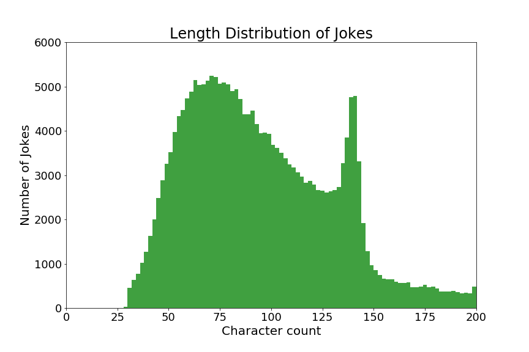

# Laughter is the Best Medicine 

  Laughter truly is the best medicine and is a great stress reliever for many of us. Sharing a joke, a funny video or even a funny moment can spice up your day. Humour can ease the physical tension and help your muscles to relax. It is not only good for your health physically, but also emotionally. Some studies show that laughter improves the cardiovascular system, reduces blood pressure, increases your resistance to diseases by declining the stress hormones and increases the antibodies counts. Humour helps to strengthen your relationships. Friendly appearance with a bright smile on your face and a good senses of humour will allow you to make good first impression with other people. 

## Instilling a Sense of Humour in Computers

  In today's scenario, computers are good at a wide variety of tasks and they can do almost all things a human can do and at a much faster rate, with less error. Computers are not only efficient in image recognition/classification or language translation, but they can also easily play strategic games such as Chess, Go, Poker, tic-tac-toe, etc., where they can easily overpower the best players in the world. If there is one thing I can think of which computers are not good at, then it is the sense of Humour.

  One of the challenges in instilling a sense a humour in computers is the lack of a scientific definition of humor. Besides, humour is highly subjective. What one finds funny may not be funny to someone else. 

  My idea here is to create a language model based on recurrent neural networks specifically long short term memory(LSTM) to generate jokes, hoping that I get atleast one line of joke out of every 50 lines of generated text. I hope that, it can also help stand-up comedians to come up with ideas, which they can improvise it on. 
  
# Creating a Joke dataset

My main criterion while creating a joke dataset was to have jokes that have good rating. There were lot of jokes available online, that didn't make much sense in my opinion and I felt that, if you feed in garbage, you get garbage out. So, I scraped those jokes, which had more than 50% rating or which had atleast +2 score(upvotes - downvotes) in the case of reddit. Here is the list of websites from where I scraped.   

The codes are available in the folder scraper. For scraping from Reddit (www.reddit.com/r/jokes), I used the PRAW (The Python Reddit API Wrapper)  library. In agreement, with the terms and conditions and not to stuff with too many requests to the Reddit website, I wait 2 seconds for every joke request. For all other websites shown in the image above, I used the powerful scrapy library. For more details, go through the readme file in the "scraper" folder. 

After scraping the jokes data from various websites, I found that most of the jokes were smaller with a median size of 150 characters. However, some jokes were upto 7000 characters long, more like a short story. So, in order to make my model train quickly and come up with short one liner jokes, I had to remove jokes that were longer. 

Here are some interesting statistics on my joke dataset,

In total, I scraped 310967 jokes including longer jokes, duplicates, jokes with inappropriate words. After cleaning the dataset by removing the duplicates, longer jokes (30 - 200 character limit) and  jokes with inappropriate words, I have **219873 clean-jokes**.

It is also interesting to note from the plot above that, there is a large number of jokes around 140 character count, which incidentally is the character limit of twitter. 

# Building a Language Model

