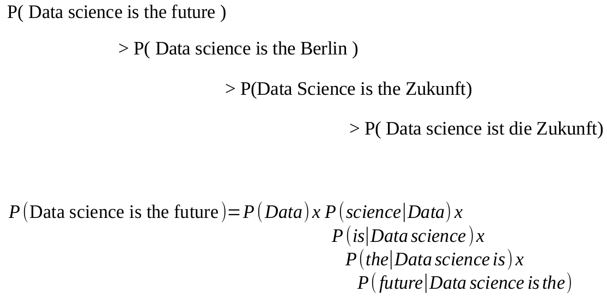
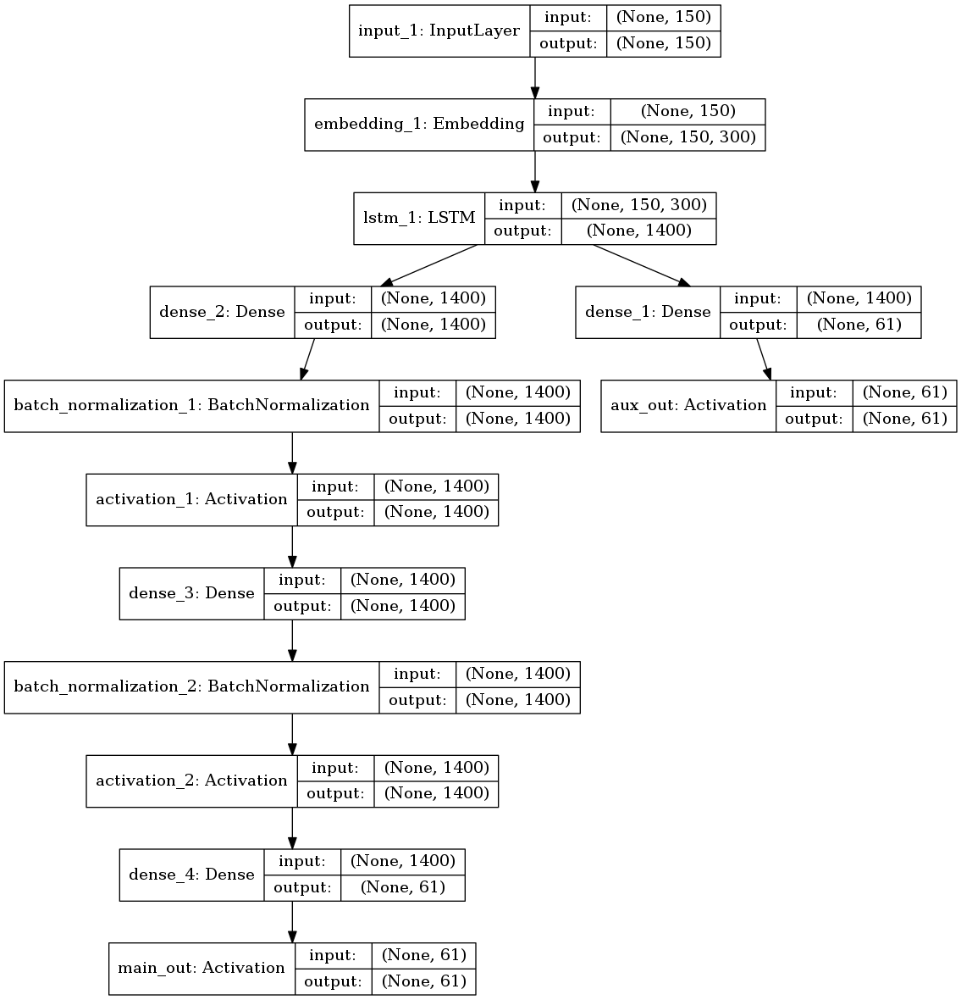

# Laughter is the Best Medicine 

  Laughter truly is the best medicine and is a great stress reliever for many of us. Sharing a joke, a funny video or even a funny moment can spice up your day. Humour can ease the physical tension and help your muscles to relax. It is not only good for your health physically, but also emotionally. Some studies show that laughter improves the cardiovascular system, reduces blood pressure, increases your resistance to diseases by declining the stress hormones and increases the antibodies counts. Humour helps to strengthen your relationships. Friendly appearance with a bright smile on your face and a good senses of humour will allow you to make good first impression with other people. 


## Instilling a Sense of Humour in Computers

  In today's scenario, computers are good at a wide variety of tasks and they can do almost all things a human can do and at a much faster rate, with less error. Computers are not only efficient in image recognition/classification or language translation, but they can also easily play strategic games such as Chess, Go, Poker, tic-tac-toe, etc., where they can easily overpower the best players in the world. If there is one thing I can think of which computers are not good at, then it is the sense of Humour.


  One of the challenges in instilling a sense a humour in computers is the lack of a scientific definition of humor. Besides, humour is highly subjective. What one finds funny may not be funny to someone else. 


  My idea here is to create a language model based on recurrent neural networks specifically long short term memory(LSTM) to generate jokes, hoping that I get atleast one line of joke out of every 50 lines of generated text. I hope that, it can also help stand-up comedians to come up with ideas, which they can improvise it on. 
  
## Creating a Joke dataset

My main criterion while creating a joke dataset was to have jokes that have good rating. There were lot of jokes available online, that didn't make much sense in my opinion and I felt that, if you feed in garbage, you get garbage out. So, I scraped those jokes, which had more than 50% rating or which had atleast +2 score(upvotes - downvotes) in the case of reddit. Here is the list of websites from where I scraped.   


The codes are available in the folder scraper. For scraping from Reddit (www.reddit.com/r/jokes), I used the PRAW (The Python Reddit API Wrapper)  library. In agreement, with the terms and conditions and not to stuff with too many requests to the Reddit website, I wait 2 seconds for every joke request. For all other websites shown in the image above, I used the powerful scrapy library. For more details, go through the readme file in the "scraper" folder. 

After scraping the jokes data from various websites, I found that most of the jokes were smaller with a median size of 150 characters. However, some jokes were upto 7000 characters long, more like a short story. So, in order to make my model train quickly and come up with short one liner jokes, I had to remove jokes that were longer. 


Here are some interesting statistics on my joke dataset,


In total, I scraped 310967 jokes including longer jokes, duplicates, jokes with inappropriate words. After cleaning the dataset by removing the duplicates, longer jokes (30 - 200 character limit) and  jokes with inappropriate words, I have **219873 clean-jokes**.

It is also interesting to note from the plot above that, there is a large number of jokes around 140 character count, which incidentally is the character limit of twitter. 

After cleaning the dataset, I found some jokes that are redundant, but with one more words difference such as 

```
What do you call a fish with no eye?   Fsh.

What do you call a fish with no eyes? A fsh.

What do you call a fish with no eyes? A fsh. What do you call a fish with four eyes?  NEEEERRRRD
```
I also found few jokes which had very good rating, but poor language. For example, consider this,

```
Hey whatcha eating ? "A pluot" Wtf is a pluot ? "A cross between 
a plum & an apricot" That 's really stupid. rides off on a liger

Alfijnbahkfnbsbbakrbbjdnebzk hzueonyvag macarena yrvixndvwhkga
ndhwkdbcbe hayvektoubabrjnahor HEYYYY MACARENA
```
 
 The last one got more than 3500 votes and I couldn't figure out the logic behind it, until I searched google and found that someone made fun of the lyrics of the song "Hey Macarena" which was famous in the 90s.
 
 These are some examples which made me rethink, whether it really makes sense to come up with a language model and make jokes which are funny. But, I included all these in my dataset and proceeded along with my LSTM model. 


## Building a Language Model

Let me give you a short and concise introduction on what a language model is and what applications require creation of a language model. Language model is basically probability distribution over a sequence of words. The example given below, best explains the language model for English. 'Data Science is the future' is more probable than 'Data science is the Berlin', which is more probable that the last two sentences with German words mixed in it.  



So, the idea of a language model is to predict the next word given a sequence of words. Language modeling is widely used in speech recognition, spelling correction/prediction, machine translation, text summarization, question-answering and so on. 

The algorithm that we will be using is a long short term memory based recurrent neural networks, which are extremely efficient in language modeling and time seriese forecasting, where previous information is of paramount importance in predicting the sequence. In our case, we will be using joke dataset to create a language model. Since the size of the corpus is too small for a language model, we will be using character level language model, which are very effective for datasets that are smaller in size. For a very good introduction to recurrent neural networks and long short term memory, please go through the following two links:

http://colah.github.io/posts/2015-08-Understanding-LSTMs/

http://karpathy.github.io/2015/05/21/rnn-effectiveness/ 

For the character level model each character is one hot encoded and sequence of characters are given as input and a single character is predicted as output based on the characters the model has seen prior to it. If your dataset has 1000 different words and an average sentence has 10 words. Then the sentence can be represented a matrix of 1000x 10 matrix. and if each word is represented by 32 bits, then 32 x 1000 x 10 will be your memory size (40 kb). Consider a language which is rich in vocabulary and these might result in using a huge amount of memory.

So, the first step in developing a good language model is to reduce the number of dimensions to represent a word.
A popular method is word2vec
king - man + woman = queen
In keras, this is available as an Embedding layer. The layer takes as input a (n_batches, sentence_length) dimensional matrix of integers representing each word in the corpus and outputs a (n_batches, sentence_length, n_embedding_dims) dimensional matrix, where the last dimension is the word embedding

There are two advantages in this:
1) First is space, instead of 40mb, a 10 word sentence embedded in 100 dimensions would take only 4 kb, which is much more reasonable. Word embeddings give the model a hint at the meaning of each word, so it will converge more quickly.
2) few parameters to play around and they are sort of tied together in a sensible way

Here is an illustrative model that was used for training one of the language models. The model was tested by playing with few hyperparameters such as the number of hidden layers, the number of hidden units, sequence length   



The model was tested by playing with few hyperparameters such as the number of hidden layers (1, 2, 3), the number eratof hidden units (512, 1024, 2048), sequence length (150, 200).   

The basic parameters can be changed in the command line as follows:

`python train.py --data_file "reduced_char_jokes.txt"`

`python train.py --data_file "reduced_char_jokes.txt" --rnn_size 1024`

`python train.py --data_file "reduced_char_jokes.txt" --rnn_size 1024 --seq_length 150`

`python train.py --data_file "reduced_char_jokes.txt" --rnn_size 1024 --seq_length 150 --num_epochs 20`

`python train.py --data_file "reduced_char_jokes.txt" --rnn_size 1024 --seq_length 150 --num_epochs 20 --batch-size 50`


Here is a plot of the trained model for different number of hidden_units.


The model overfits in the cases where the hidden units are larger. But in our case, we do not care much about overfitting as long as the generated text is not available in the input joke corpus.  Another reason is that, LSTM networks too long to train in the order of few days. Considering the time limit, I had to consider training the best working model in the available time limit. 

To generate text from a trained model, use the following commands,

`python sample.py --model_file "save/model.hdf5"`

To be more conservative in the generated output use temperature 0 or to make it more exploratory, use temperature 1.

`python sample.py --model_file "save/model.hdf5" --temperature 0.7`

You can also generate text, using a seed text using the variable 'prime',

`python sample.py --model_file "save/model.hdf5" --prime "Chuch norris can "`

You can change the length of the generated text by using the variable 'length',

`python sample.py --model_file "save/model.hdf5" --length 2000`

## Generated jokes 

Here comes the fun part. Here are some examples of the generated jokes.

```
A zombie walks into a bar. the bartender says, Hey, we don't serve food in here.

What do you call a fish with no eyes? No idea

I was going to make a joke about the movie Titanic, but I didn't want to go on.

What do you call a Mexican who runs for Christmas? A secret enemy.

What do you call a man with no arms and no legs, but only one dog in the bedroom to record? An interracist.

I was going to make a joke about the movie Titanic, but I didn't want to go on.

I have a problem with my mom. It's gonna be so great.
 
Why did the blonde stare at her windows for hours?  First she liked it.

What do you call a cat who flies a plane? A pilot.

What do you get if you cross a snowman with an Irishman? Wouldn't worry about it.

What do you call a cow with no eyes? Disappointment

How many hipsters does it take to change a  light bulb? Only one but I have no idea how they got in there

```


